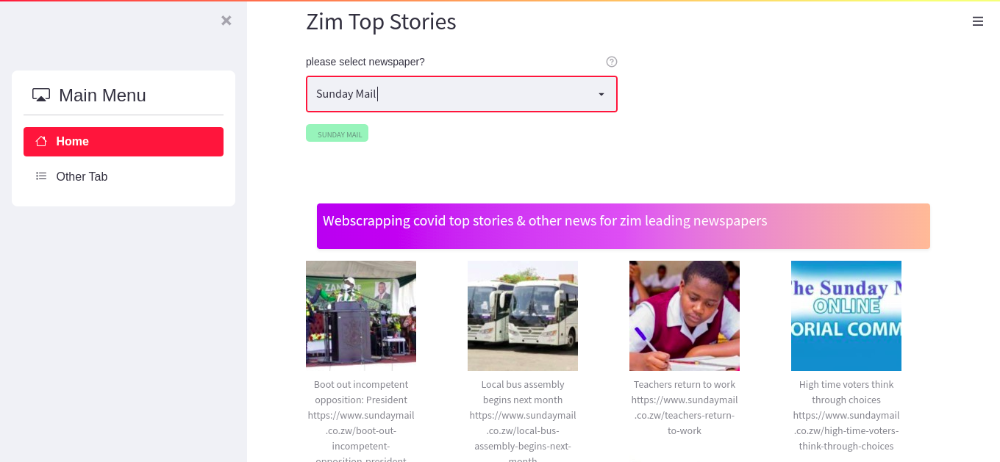

# Scrapping-News-Data
Web Scrapping news data from leading newspapers in Zimbabwe. The app includes newspapers such as [Herald Zimbabwe](https://www.herald.co.zw/category/articles/top-stories) , [Chronicle](https://www.chronicle.co.zw/category/s6-demo-section/c37-top-stories/), [Sunday Mail](https://www.sundaymail.co.zw/category/news/top-stories) among others

#### What is web scrapping
[Web scraping](https://www.parsehub.com/blog/what-is-web-scraping/) refers to the extraction of data from a website. This information is collected and then exported into a format that is more useful for the user. Be it a spreadsheet or an API.

Streamlit is an open-source 
Python library that makes it easy to create and share beautiful,
custom web apps for machine learning and data science. In just a few minutes you can build and deploy powerful data apps.
[Streamlit Docs](https://docs.streamlit.io/library/get-started)

#### To install relevant packages
Open your shell or terminal and install the relevant packages using the command below

```python
pip install -r requirements.txt
```

#### To run this Application
Open the root folder of the project and run the command below:
```python
streamlit run main.py
```

#### Dashboard Example: 

